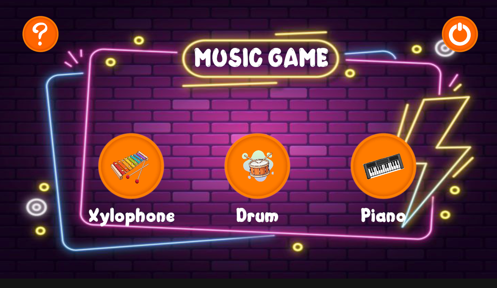
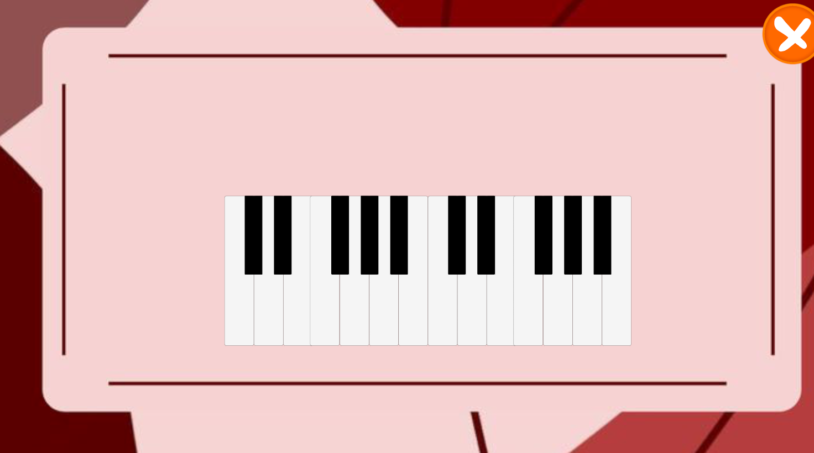
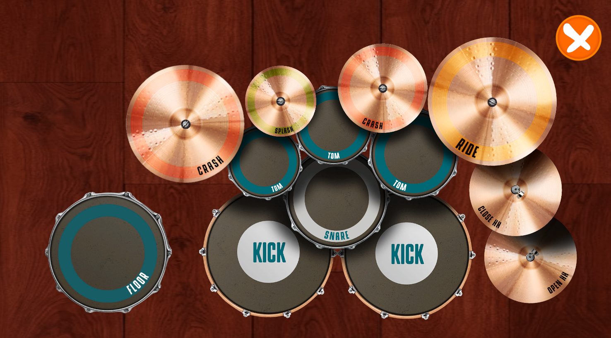

# 🎵 Interactive Music Learning App

An interactive educational music application designed to introduce children to basic musical instruments such as drums, piano, and xylophone in a fun and engaging way.

This project focuses on interactive sound exploration, colorful UI, and intuitive gameplay to support early childhood learning.

---

## ✨ Features

- 🥁 **Drum Simulation**  
  Interactive drum sounds with responsive touch/click input.

- 🎹 **Piano Mode**  
  Playable piano keys with accurate note sounds.

- 🎶 **Xylophone Mode**  
  Colorful xylophone bars with individual tones.

- 🎨 **Child-Friendly UI**  
  Designed with bright visuals and simple navigation.

- 🧩 **Modular Scene System**  
  Each instrument is separated into structured scenes.

---

## 📱 App Preview

<p align="center">
  
  &nbsp;&nbsp;&nbsp &nbsp;&nbsp;&nbsp
  
  &nbsp;&nbsp;&nbsp &nbsp;&nbsp;&nbsp
  
</p>

<p align="center">
  <i>Interactive Music Learning Application</i>
</p>

---

## 🚀 How to Run the Project

1. **Install Requirements**
   - Unity Hub
   - Unity 6 (6000.x) or compatible version

2. **Clone the Repository**
   ```bash
   git clone https://github.com/RizqyAzaria/Music.git
   ```

3. **Open in Unity Hub**
   - Click **Add project from disk**
   - Select the project folder

4. **Wait for Asset Import**
   - Allow Unity to finish importing all assets

5. **Open Main Scene**
   ```
   Scenes/MainApp
   ```

6. **Press Play ▶**
   - Run the application from Unity Editor

---

## 📁 Project Structure

The project follows a modular and organized folder structure to improve scalability and maintainability.

```
Assets/
├─ Asset_Drum/        # Drum sprites, sounds, prefabs
├─ Asset_Piano/       # Piano sprites, sounds, prefabs
├─ Asset_Xylophone/   # Xylophone sprites and audio
├─ Asset_Mixed/       # Shared assets across instruments
├─ Easter_UI/         # UI themes and decorative elements
├─ Scenes/            # Unity scene files
├─ Scripts/           # C# scripts (logic & interaction)
├─ Settings/          # Project settings and configuration files
└─ TextMesh Pro/      # Font assets and TMP configurations
```

---

## 🎯 Target Audience

- Early childhood learners  
- Parents and teachers  
- Beginner music students  

---

## 🛠️ Technologies Used

- Unity Engine
- C#
- TextMesh Pro
- 2D UI System
- AudioSource & AudioClip

---

## 🎯 Target Users

- Children (Early Childhood Education).
- Parents.
- Teachers and educators.

---

## 🤝 Contributing

Contributions are welcome!

1. Fork this repository.
2. Create a new branch (feature/new-feature).
3. Commit your changes.
4. Push to the branch.
5. Open a Pull Request.

---

## 📄 License

This project is licensed under the MIT License.
Feel free to use, modify, and distribute this project for educational purposes.
